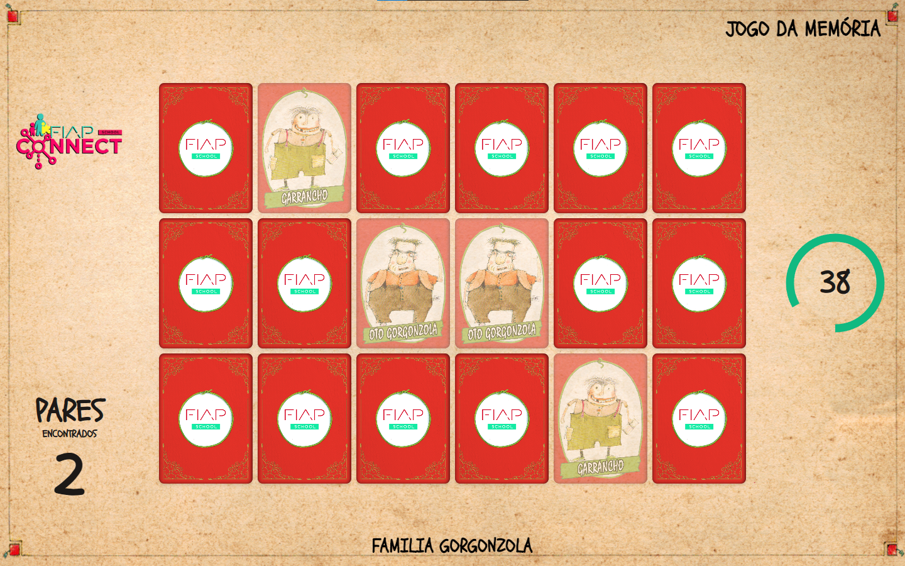

# 🃏 Jogo da Memória

Um jogo da memória desenvolvido em **HTML**, **CSS (Tailwind)** e **JavaScript**.  
O objetivo é encontrar todos os pares antes que o tempo acabe ⏳.

---

## 🎮 Funcionalidades

- Interface amigável com cartas animadas.
- Sistema de pares encontrados em tempo real.
- Timer circular com cores dinâmicas:
  - 🟢 Verde = tempo normal
  - 🟡 Amarelo = alerta (10s)
  - 🔴 Vermelho = quase acabando (5s)
- Contador de pares encontrados.
- Mensagem de fim de jogo.

---

## 🖼️ Capturas de Tela

### Tela inicial

### Verso da carta

### Exemplo de carta

---

## 📂 Estrutura do Projeto

